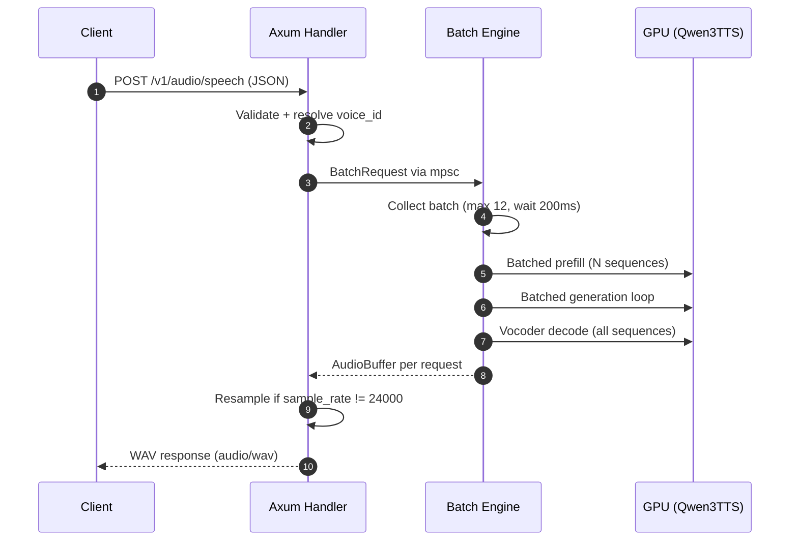
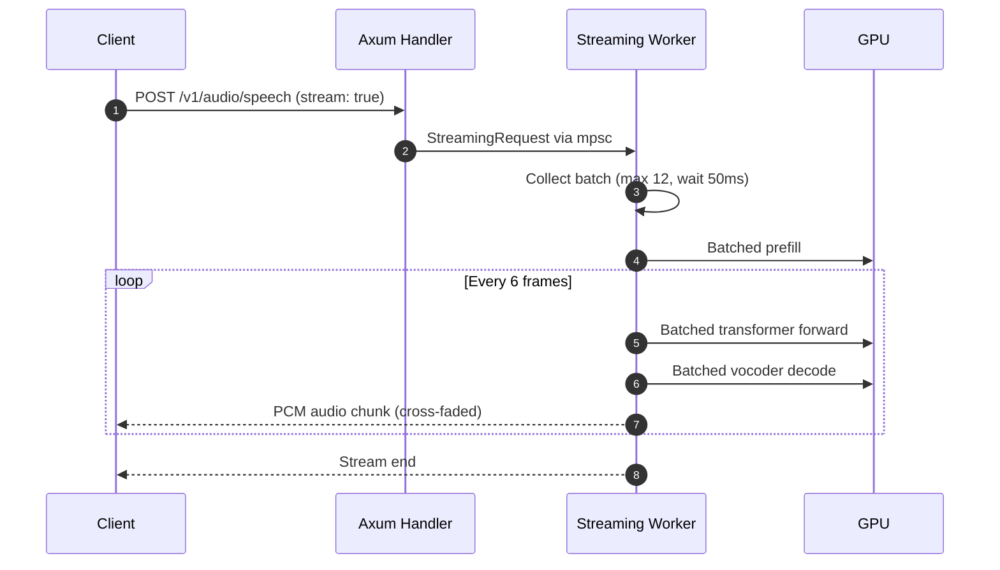
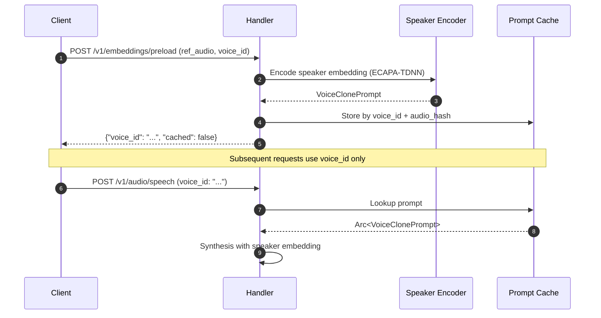
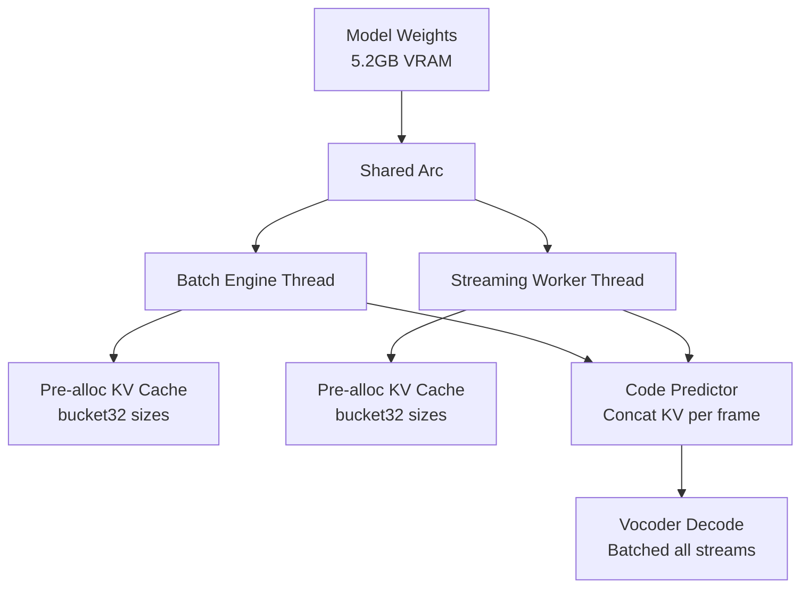

# Diagrams

## Request Flow — Batch Synthesis

```mermaid
sequenceDiagram
    autonumber
    participant C as Client
    participant H as Axum Handler
    participant B as Batch Engine
    participant G as GPU (Qwen3TTS)

    C->>H: POST /v1/audio/speech (JSON)
    H->>H: Validate + resolve voice_id
    H->>B: BatchRequest via mpsc
    B->>B: Collect batch (max 12, wait 200ms)
    B->>G: Batched prefill (N sequences)
    B->>G: Batched generation loop
    B->>G: Vocoder decode (all sequences)
    B-->>H: AudioBuffer per request
    H->>H: Resample if sample_rate != 24000
    H-->>C: WAV response (audio/wav)
```

## Request Flow — Streaming

```mermaid
sequenceDiagram
    autonumber
    participant C as Client
    participant H as Axum Handler
    participant S as Streaming Worker
    participant G as GPU

    C->>H: POST /v1/audio/speech (stream: true)
    H->>S: StreamingRequest via mpsc
    S->>S: Collect batch (max 12, wait 50ms)
    S->>G: Batched prefill
    loop Every 6 frames
        S->>G: Batched transformer forward
        S->>G: Batched vocoder decode
        S-->>C: PCM audio chunk (cross-faded)
    end
    S-->>C: Stream end
```

## Voice Clone Flow

```mermaid
sequenceDiagram
    autonumber
    participant C as Client
    participant H as Handler
    participant E as Speaker Encoder
    participant Cache as Prompt Cache

    C->>H: POST /v1/embeddings/preload (ref_audio, voice_id)
    H->>E: Encode speaker embedding (ECAPA-TDNN)
    E-->>H: VoiceClonePrompt
    H->>Cache: Store by voice_id + audio_hash
    H-->>C: {"voice_id": "...", "cached": false}

    Note over C,Cache: Subsequent requests use voice_id only

    C->>H: POST /v1/audio/speech (voice_id: "...")
    H->>Cache: Lookup prompt
    Cache-->>H: Arc<VoiceClonePrompt>
    H->>H: Synthesis with speaker embedding
```

## Memory Architecture

```mermaid
graph TD
    A[Model Weights<br>5.2GB VRAM] --> B[Shared Arc]
    B --> C[Batch Engine Thread]
    B --> D[Streaming Worker Thread]
    C --> E[Pre-alloc KV Cache<br>bucket32 sizes]
    D --> F[Pre-alloc KV Cache<br>bucket32 sizes]
    C --> G[Code Predictor<br>Concat KV per frame]
    D --> G
    G --> H[Vocoder Decode<br>Batched all streams]
```
